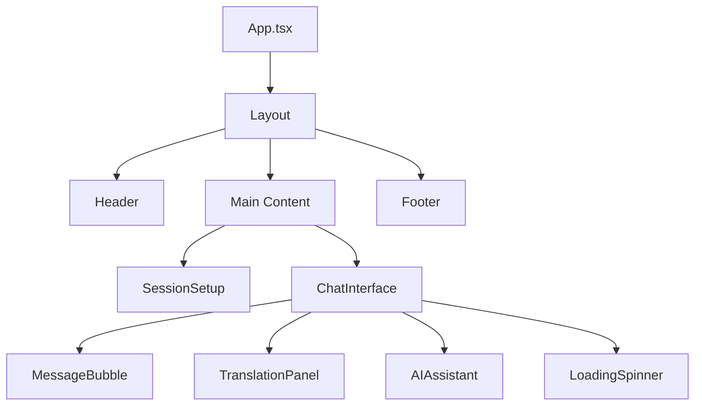

# 🔧 End2End Chat - Components Documentation

<div align="center">


</div>

---

## 📁 **Component Architecture**

### **Core Components Structure**
```
src/components/
├── 💬 ChatInterface.tsx      # Main chat functionality
├── 💭 MessageBubble.tsx      # Individual message display
├── ⚙️ SessionSetup.tsx       # Session creation/joining
├── 🌐 TranslationPanel.tsx   # Translation interface
├── 🤖 AIAssistant.tsx        # AI features integration
├── 🎨 Layout.tsx             # Main app layout
├── 📄 Header.tsx             # Navigation header
├── 🦶 Footer.tsx             # App footer
├── 🔄 LoadingSpinner.tsx     # Loading states
├── ⬆️ BackToTop.tsx          # Scroll to top button
├── 🍪 CookieConsent.tsx      # Privacy compliance
├── 💰 DonationButton.tsx     # Support feature
└── 📊 AdSense.tsx            # Advertisement integration
```

---

## 🚀 **Main Components**

### **1. ChatInterface Component**
**File:** `ChatInterface.tsx` (1,208 lines)

**🔥 Core Features:**
- **Triple Chat Modes:** Group, Private, Password-protected
- **Real-time Messaging:** WebSocket-based communication
- **End-to-end Encryption:** RSA-2048 + AES-256 hybrid
- **File Sharing:** Multi-format encrypted file transfer
- **Screenshot Protection:** Advanced security system
- **Typing Indicators:** Real-time user activity
- **AI Integration:** Smart replies and moderation

**📊 Key State Management:**
```typescript
interface ChatInterfaceState {
  messages: Message[]
  peers: PublicKey[]
  keyPair: KeyPair | null
  chatMode: 'private' | 'group' | 'password'
  sessionKey: CryptoKey | null
  typingUsers: Set<string>
  notifications: Notification[]
}
```

**🔐 Security Features:**
- Advanced keyboard event blocking
- Screenshot attempt detection
- Suspicious activity tracking
- Clipboard protection
- Developer tools blocking

---

### **2. MessageBubble Component**
**File:** `MessageBubble.tsx`

**💬 Message Display Features:**
- **Rich Message Types:** Text, images, videos, audio, files
- **Encryption Status:** Visual security indicators
- **File Previews:** Thumbnail generation and display
- **Download Tracking:** File access notifications
- **Caption Support:** Text descriptions for media
- **Timestamp Display:** Message timing information

**🎨 Visual Elements:**
- Sender/receiver message styling
- File type icons and previews
- Encryption badges
- Loading states for media
- Error handling displays

---

### **3. SessionSetup Component**
**File:** `SessionSetup.tsx`

**🏗️ Session Management:**
- **Session Creation:** Generate new encrypted rooms
- **Session Joining:** Connect to existing sessions
- **Mode Selection:** Choose chat type (Group/Private/Password)
- **User Configuration:** Set display names and preferences
- **Security Settings:** Configure protection levels
- **Room Validation:** Verify session accessibility

**⚙️ Configuration Options:**
- Chat mode selection
- User identity setup
- Security level configuration
- Room capacity settings
- Password protection setup

---

### **4. TranslationPanel Component**
**File:** `TranslationPanel.tsx`

**🌐 Translation Features:**
- **Language Detection:** Automatic source language identification
- **Multi-language Support:** 50+ language pairs
- **Real-time Translation:** Instant message conversion
- **Translation History:** Previous translations cache
- **Language Selection:** Source and target language chooser
- **Translation Quality:** Confidence scoring

**🔧 Technical Implementation:**
- Google Cloud Translation API integration (planned)
- Mock data for demo purposes
- Caching system for efficiency
- Error handling and fallbacks
- Performance optimization

---

### **5. AIAssistant Component**
**File:** `AIAssistant.tsx`

**🤖 AI-Powered Features:**
- **Smart Replies:** Context-aware message suggestions
- **Content Moderation:** Automatic toxicity detection
- **Message Enhancement:** Grammar and clarity suggestions
- **Conversation Analysis:** Sentiment and topic detection
- **Language Support:** Multi-lingual AI processing
- **Privacy Protection:** Local processing when possible

**🧠 AI Integration:**
- Google Gemini AI API
- Real-time processing
- Context understanding
- Privacy-preserving analysis
- Fallback mechanisms

---

## 🎨 **UI/UX Components**

### **6. Layout Component**
**File:** `Layout.tsx`

**🏗️ App Structure:**
- **Responsive Design:** Mobile, tablet, desktop layouts
- **Navigation System:** Header, sidebar, footer integration
- **Theme Management:** Dark/light mode support
- **Accessibility:** Screen reader and keyboard navigation
- **SEO Optimization:** Meta tags and structured data
- **Performance:** Code splitting and lazy loading

**📱 Responsive Features:**
- Breakpoint management
- Touch-friendly interfaces
- Mobile-first design
- Adaptive layouts

---

### **7. Header Component**
**File:** `Header.tsx`

**🧭 Navigation Features:**
- **Brand Identity:** Logo and application name
- **Navigation Menu:** Page links and user actions
- **User Status:** Connection and encryption status
- **Theme Toggle:** Dark/light mode switcher
- **Mobile Menu:** Collapsible navigation for mobile
- **Security Indicators:** Visual encryption status

---

### **8. Footer Component**
**File:** `Footer.tsx`

**🦶 Footer Information:**
- **Legal Links:** Privacy policy, terms of service
- **Social Media:** GitHub, documentation links
- **Contact Information:** Support and feedback
- **Version Information:** Current app version
- **Security Badges:** Encryption and privacy indicators
- **Compliance Info:** GDPR, privacy certifications

---

## 🔧 **Utility Components**

### **9. LoadingSpinner Component**
**File:** `LoadingSpinner.tsx`

**⏳ Loading States:**
- **Visual Feedback:** Animated loading indicators
- **Context-Aware:** Different spinners for different actions
- **Accessibility:** Screen reader announcements
- **Theming:** Matches app visual style
- **Performance:** Optimized animations
- **Customization:** Size and color variants

---

### **10. BackToTop Component**
**File:** `BackToTop.tsx`

**⬆️ Navigation Helper:**
- **Smooth Scrolling:** Animated scroll to top
- **Visibility Logic:** Shows/hides based on scroll position
- **Accessibility:** Keyboard navigation support
- **Performance:** Throttled scroll event handling
- **Styling:** Consistent with app theme

---

### **11. CookieConsent Component**
**File:** `CookieConsent.tsx`

**🍪 Privacy Compliance:**
- **GDPR Compliance:** Cookie consent management
- **Granular Controls:** Specific consent categories
- **Persistent Storage:** Remember user preferences
- **Legal Compliance:** Required disclosure information
- **Customizable:** Configurable consent options
- **Accessibility:** Screen reader compatible

---

### **12. DonationButton Component**
**File:** `DonationButton.tsx`

**💰 Support Features:**
- **Multiple Platforms:** Various donation methods
- **Secure Processing:** Protected payment flows
- **Thank You System:** Donor appreciation
- **Progress Tracking:** Funding goal displays
- **Transparency:** Usage reporting
- **Accessibility:** Full keyboard support

---

### **13. AdSense Component**
**File:** `AdSense.tsx`

**📊 Advertisement Integration:**
- **Google AdSense:** Monetization support
- **Privacy Compliant:** GDPR-compatible ads
- **Performance Optimized:** Lazy loading ads
- **Ad Blocking Detection:** Graceful degradation
- **Revenue Optimization:** Strategic ad placement
- **User Experience:** Non-intrusive integration

---

## 🔄 **Component Interactions**

### **Data Flow Architecture**


### **State Management**
- **React Hooks:** useState, useEffect, useRef
- **Context API:** Global state management
- **Local Storage:** Persistent user preferences
- **Session Storage:** Temporary session data
- **WebSocket State:** Real-time connection management

### **Event Handling**
- **Keyboard Events:** Message input, shortcuts, security
- **Mouse Events:** Click handlers, drag & drop
- **Touch Events:** Mobile gesture support
- **WebSocket Events:** Real-time message handling
- **File Events:** Upload, download, preview

---

## 🛡️ **Security Implementation**

### **Component-Level Security**
- **Input Validation:** XSS prevention
- **Content Sanitization:** Safe HTML rendering
- **File Type Validation:** Secure file handling
- **CSRF Protection:** Token-based validation
- **Rate Limiting:** Abuse prevention
- **Error Boundaries:** Safe error handling

### **Privacy Features**
- **Data Minimization:** Only necessary data collection
- **Encryption Integration:** Seamless security
- **Anonymous Usage:** No tracking implementation
- **Secure Defaults:** Privacy-first configuration
- **Consent Management:** User choice respect

---

## 📊 **Performance Optimization**

### **Component Performance**
- **React.memo:** Unnecessary re-render prevention
- **useMemo/useCallback:** Expensive computation caching
- **Code Splitting:** Dynamic import optimization
- **Lazy Loading:** On-demand component loading
- **Bundle Analysis:** Size optimization
- **Memory Management:** Cleanup and disposal

### **Rendering Optimization**
- **Virtual Scrolling:** Large message list handling
- **Image Optimization:** Lazy loading and compression
- **Animation Performance:** GPU acceleration
- **Event Throttling:** Performance-critical events
- **Resource Management:** Memory leak prevention

---

## 🧪 **Testing Strategy**

### **Component Testing**
- **Unit Tests:** Individual component logic
- **Integration Tests:** Component interactions
- **Accessibility Tests:** Screen reader compatibility
- **Performance Tests:** Render time optimization
- **Security Tests:** Input validation verification
- **Visual Regression:** UI consistency checking

### **User Experience Testing**
- **Usability Tests:** Real user scenarios
- **Cross-browser Testing:** Compatibility verification
- **Mobile Testing:** Touch interface validation
- **Load Testing:** Performance under stress
- **Security Testing:** Penetration testing
- **Privacy Testing:** Data handling verification

---

<div align="center">

## 🏗️ **Component Dependencies**

| Component | Dependencies | Purpose |
|-----------|--------------|---------|
| ChatInterface | WebSocket, Crypto, Firebase | Core messaging |
| MessageBubble | File handling, Encryption | Message display |
| TranslationPanel | Google APIs, Language detection | Translation |
| AIAssistant | Gemini AI, Content analysis | AI features |
| Layout | Router, Theme, SEO | App structure |
| SessionSetup | Validation, Crypto | Session management |

</div>

---

## 📚 **Development Guidelines**

### **Code Standards**
- **TypeScript:** Strict type checking
- **ESLint:** Code quality enforcement
- **Prettier:** Code formatting consistency
- **Accessibility:** WCAG 2.1 compliance
- **Performance:** Core Web Vitals optimization
- **Security:** OWASP guidelines adherence

### **Best Practices**
- **Component Composition:** Reusable, modular design
- **Props Interface:** Clear TypeScript interfaces
- **Error Handling:** Comprehensive error boundaries
- **Testing Coverage:** Minimum 80% code coverage
- **Documentation:** Inline comments and README
- **Version Control:** Semantic commit messages

---

<div align="center">

**🔧 Built with Modern React Architecture**

[](https://reactjs.org/)
[](https://www.typescriptlang.org/)
[](https://vitejs.dev/)

</div>
