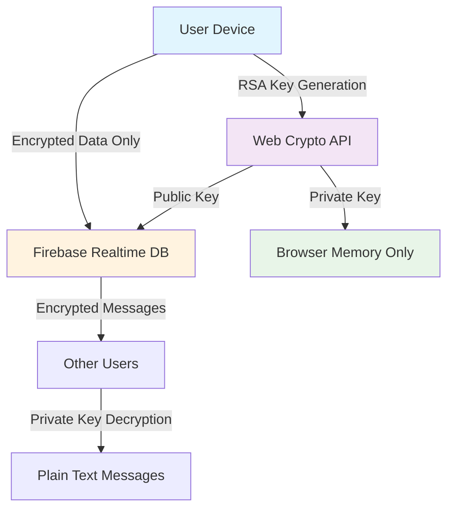
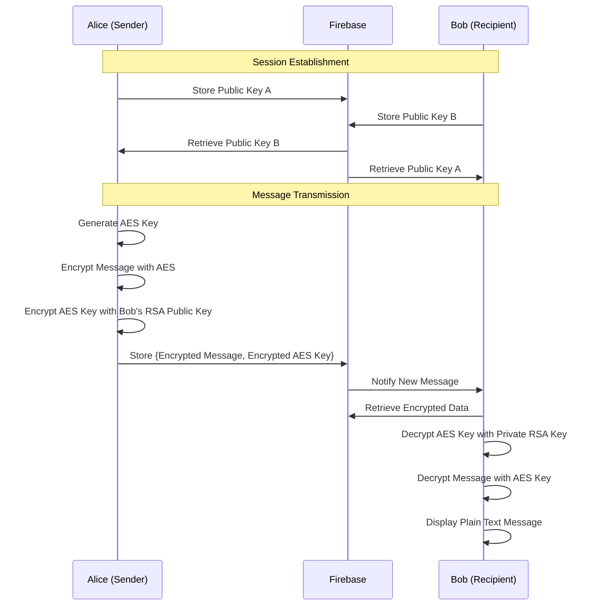

# � End-to-End Encrypted Chat Application

<div align="center">


[](https://github.com/Arya182-ui/End2end-Chat)
[](https://github.com/Arya182-ui/End2end-Chat)
[](https://github.com/Arya182-ui/End2end-Chat)
[](https://end2end-chat.web.app)

</div>

---

## 🌟 **Project Overview**

A **military-grade encrypted** real-time chat application built with modern web technologies, featuring **RSA-OAEP 2048-bit encryption**, **anonymous messaging**, and **zero-knowledge architecture**. This project demonstrates advanced cybersecurity principles with a focus on privacy, anonymity, and secure communication protocols.

**🎯 Core Philosophy:** *"Your messages, your keys, your privacy - completely under your control."*

### 🚀 **Why This Project Matters**

<details>
<summary><b>🔒 Privacy in the Digital Age</b></summary>

In an era where digital privacy is constantly under threat, this application demonstrates:
- **True End-to-End Encryption**: Messages encrypted on sender's device, decrypted only by intended recipient
- **Zero-Knowledge Architecture**: Even the server cannot read your messages
- **Anonymous Communication**: No personal data required or stored
- **Ephemeral Messaging**: Messages exist only during active sessions

</details>

<details>
<summary><b>🛡️ Advanced Security Implementation</b></summary>

- **Hybrid Cryptography**: Combines RSA-OAEP with AES-GCM for optimal security and performance
- **Client-Side Key Generation**: Private keys never leave your device
- **Forward Secrecy**: Each session uses unique encryption keys
- **Automatic Session Cleanup**: No persistent message history

</details>

## 🔐 **Advanced Security Features**

<div align="center">

[](https://github.com/Arya182-ui/End2end-Chat)
[](https://github.com/Arya182-ui/End2end-Chat)
[](https://github.com/Arya182-ui/End2end-Chat)

</div>

### 🛡️ **Core Security Features**

<details>
<summary><b>🔒 Cryptographic Implementation</b></summary>

| **Feature** | **Implementation** | **Security Benefit** |
|-------------|-------------------|---------------------|
| � **End-to-End Encryption** | RSA-OAEP 2048-bit + AES-GCM | Military-grade message protection |
| 🗝️ **Key Management** | Client-side generation, memory-only storage | Private keys never transmitted |
| 🔄 **Hybrid Encryption** | RSA for key exchange, AES for message content | Optimal security + performance |
| 🛡️ **Forward Secrecy** | Session-based ephemeral keys | Past messages remain secure |
| 🚫 **Zero-Knowledge** | Server cannot decrypt any content | Complete privacy guarantee |

</details>

<details>
<summary><b>⚡ Real-Time & Anonymous Features</b></summary>

- ⚡ **Real-Time Messaging** via Firebase Realtime Database with encrypted payloads
- 🕵️ **Anonymous Usage** – No login, signup, or personal data collection
- 🌐 **Serverless Architecture** – No backend server means no central point of failure
- � **Cross-Platform Support** – Works seamlessly across all devices and browsers
- 🧹 **Automatic Cleanup** – Sessions and data automatically purged when users leave
- 🛡️ **Visual Security Indicators** – Real-time encryption status and security confirmations

</details>

<details>
<summary><b>👥 Advanced Group Communication</b></summary>

- � **Multi-User Encryption** – Each message encrypted individually for every participant
- 🔄 **Dynamic Key Exchange** – Automatic public key distribution and management
- 🖼️ **Secure File Sharing** – Images and files encrypted with same security standards
- � **Group Management** – Real-time participant tracking and session control
- 🔐 **Individual Decryption** – Each user maintains their own private key for message access

</details>

<details>
<summary><b>🧑‍💻 Developer & Deployment Features</b></summary>

- �️ **Easy Setup** – Minimal configuration required for deployment
- 📚 **Well-Documented** – Comprehensive code documentation and security explanations
- 🔧 **Extensible Architecture** – Modular design for easy feature additions
- � **Firebase Integration** – Leverages Google's infrastructure for reliability
- 📈 **Scalable Design** – Handles multiple concurrent sessions efficiently

</details>

---

## ⚡ **Technology Stack & Architecture**

<div align="center">

| **Category** | **Technology** | **Purpose** | **Security Role** |
|--------------|----------------|-------------|------------------|
| 🎨 **Frontend** | React 18 + TypeScript | Modern UI/UX | Type safety and secure coding |
| 🔥 **Backend** | Firebase Realtime DB | Real-time sync | Encrypted data transmission only |
| 🔐 **Cryptography** | Web Crypto API | Native encryption | Browser-level security implementation |
| 🎨 **Styling** | Tailwind CSS | Responsive design | Clean, professional interface |
| 🛠️ **Build Tool** | Vite | Fast development | Optimized production builds |
| 📦 **Deployment** | Firebase Hosting | Global CDN | HTTPS-only secure delivery |

</div>

### 🏗️ **System Architecture Overview**

<details>
<summary><b>🔒 Security-First Architecture Design</b></summary>



**🛡️ Security Principles:**
- **Zero-Knowledge Server**: Firebase only stores encrypted data blobs
- **Client-Side Encryption**: All cryptographic operations happen in the browser
- **Memory-Only Keys**: Private keys never touch storage or network
- **Ephemeral Sessions**: Complete data cleanup on session end

</details>

---

## ☕ **Support the Project**

<div align="center">

[](https://www.buymeacoffee.com/arya182)
[](https://github.com/sponsors/Arya182-ui)
[](https://github.com/Arya182-ui/End2end-Chat)

</div>

**💝 Your support helps maintain and improve this privacy-focused project!**

*Supporting privacy tools contributes to a safer digital world for everyone.*

---

## 📸 **Live Demo & Screenshots**

<div align="center">

[](https://end2end-chat.web.app)
[](https://end2end-chat.web.app)

</div>

### 🎯 **Try It Yourself**

<details>
<summary><b>🔴 Live Demo Instructions</b></summary>

1. **🌐 Visit Demo**: [https://end2end-chat.web.app](https://end2end-chat.web.app)
2. **🆕 Create Session**: Generate a new encrypted chat session
3. **📋 Share Code**: Copy the session code to share with others
4. **🔐 Start Chatting**: Experience military-grade encrypted messaging
5. **🛡️ Verify Security**: Watch real-time encryption indicators

**🔍 Security Verification:**
- Open browser developer tools to see encrypted message payloads
- Verify that no plain text messages are transmitted
- Confirm private keys remain in browser memory only

</details>

### 📱 **Interface Preview**

> 🚧 **Screenshots and GIF demonstrations will be added soon!**
> 
> *The interface features a clean, modern design with real-time encryption status indicators, anonymous user identification, and intuitive message encryption/decryption workflows.*

**Preview Features:**
- 🎨 **Clean Material Design** inspired interface
- 🔒 **Visual Encryption Indicators** showing message security status
- 👥 **Anonymous User Avatars** with session-based identities
- 📱 **Responsive Layout** optimized for all screen sizes
- ⚡ **Real-time Typing Indicators** with encrypted status
- 🛡️ **Security Dashboard** showing session encryption details

---

## 🚀 **Quick Start Guide**

<div align="center">

[](https://github.com/Arya182-ui/End2end-Chat)
[](https://github.com/Arya182-ui/End2end-Chat)
[](https://nodejs.org)

</div>

### � **Prerequisites**

<details>
<summary><b>📋 Required Tools & Accounts</b></summary>

**�🛠️ Development Environment:**
- **Node.js**: Version 18 or higher ([Download](https://nodejs.org))
- **npm**: Comes with Node.js (or use yarn/pnpm)
- **Git**: For cloning the repository ([Download](https://git-scm.com))
- **Modern Browser**: Chrome, Firefox, Safari, or Edge with Web Crypto API support

**☁️ External Services:**
- **Firebase Account**: Free tier is sufficient ([Sign up](https://firebase.google.com))
- **Code Editor**: VS Code, WebStorm, or your preferred IDE

</details>

### ⚡ **Installation Methods**

<details>
<summary><b>🎯 Method 1: Quick Setup (Recommended)</b></summary>

```bash
# 1️⃣ Clone the repository
git clone https://github.com/Arya182-ui/End2end-Chat.git
cd End2end-Chat

# 2️⃣ Install dependencies
npm install

# 3️⃣ Configure Firebase (see Firebase Setup section below)
# Copy your Firebase config to src/firebase/config.ts

# 4️⃣ Start development server
npm run dev
```

**🎉 Your encrypted chat app will be running at:** `http://localhost:5173`

</details>

<details>
<summary><b>🔬 Method 2: Development Setup with Testing</b></summary>

```bash
# Clone and setup
git clone https://github.com/Arya182-ui/End2end-Chat.git
cd End2end-Chat

# Install all dependencies including dev tools
npm install

# Run security tests (optional)
npm run test

# Start with hot reloading
npm run dev

# Build for production testing
npm run build
npm run preview
```

</details>

### 🔥 **Firebase Configuration**

<details>
<summary><b>🔧 Step-by-Step Firebase Setup</b></summary>

**1️⃣ Create Firebase Project:**
1. Navigate to [Firebase Console](https://console.firebase.google.com/)
2. Click "Create a project" or "Add project"
3. Enter project name (e.g., "my-e2e-chat")
4. Disable Google Analytics (optional for this project)
5. Click "Create project"

**2️⃣ Enable Realtime Database:**
1. In your Firebase project, go to "Realtime Database"
2. Click "Create Database"
3. Choose your preferred location
4. Start in **locked mode** (we'll configure rules next)

**3️⃣ Configure Database Security Rules:**
```json
{
  "rules": {
    "chats": {
      "$sessionId": {
        ".read": true,
        ".write": true,
        "messages": {
          ".validate": "newData.hasChildren(['from', 'encrypted', 'timestamp'])"
        },
        "publicKeys": {
          ".validate": "newData.isString()"
        }
      }
    }
  }
}
```

**4️⃣ Get Web App Configuration:**
1. Go to Project Settings (gear icon) → General tab
2. Scroll to "Your apps" section
3. Click "Add app" → Web app (</>) icon
4. Register app with a nickname
5. Copy the configuration object

**5️⃣ Update Configuration File:**
```typescript
// src/firebase/config.ts
export const firebaseConfig = {
  apiKey: "your-api-key",
  authDomain: "your-project.firebaseapp.com",
  databaseURL: "https://your-project-default-rtdb.firebaseio.com/",
  projectId: "your-project-id",
  storageBucket: "your-project.appspot.com",
  messagingSenderId: "123456789",
  appId: "your-app-id"
};
```

</details>

---

## 🏗️ **Advanced Architecture & Security Implementation**

<div align="center">

[](https://github.com/Arya182-ui/End2end-Chat)
[](https://github.com/Arya182-ui/End2end-Chat)
[](https://github.com/Arya182-ui/End2end-Chat)

</div>

### 📊 **Database Structure & Security Model**

<details>
<summary><b>🗄️ Firebase Realtime Database Schema</b></summary>

```typescript
// Database Structure (All data encrypted except metadata)
{
  "chats": {
    "{sessionId}": {
      "publicKeys": {
        "{userId}": "base64-encoded-rsa-public-key"
      },
      "messages": {
        "{messageId}": {
          "from": "userIdA",
          "to": "userIdB" | "group",
          "encrypted": "base64-aes-encrypted-content",
          "encryptedKeys": {
            "userIdA": "base64-rsa-encrypted-aes-key",
            "userIdB": "base64-rsa-encrypted-aes-key"
          },
          "timestamp": 1640995200000,
          "type": "text" | "image" | "file"
        }
      },
      "participants": {
        "{userId}": {
          "lastSeen": 1640995200000,
          "status": "online" | "offline"
        }
      }
    }
  }
}
```

**🔒 Security Properties:**
- **Zero Knowledge**: Server never sees plain text content
- **Forward Secrecy**: Each message uses unique AES key
- **Perfect Forward Secrecy**: RSA keys are session-ephemeral
- **Metadata Minimization**: Only essential routing data stored

</details>

### 🛡️ **Cryptographic Implementation Details**

<details>
<summary><b>🔐 Hybrid Encryption Algorithm</b></summary>

**📚 Encryption Process:**

```typescript
// 1. RSA Key Pair Generation (Per Session)
const keyPair = await crypto.subtle.generateKey(
  {
    name: "RSA-OAEP",
    modulusLength: 2048,
    publicExponent: new Uint8Array([1, 0, 1]),
    hash: "SHA-256"
  },
  true, // extractable
  ["encrypt", "decrypt"]
);

// 2. AES Key Generation (Per Message)
const aesKey = await crypto.subtle.generateKey(
  {
    name: "AES-GCM",
    length: 256
  },
  true,
  ["encrypt", "decrypt"]
);

// 3. Message Encryption Process
const encryptedMessage = await crypto.subtle.encrypt(
  {
    name: "AES-GCM",
    iv: crypto.getRandomValues(new Uint8Array(12))
  },
  aesKey,
  messageBuffer
);

// 4. AES Key Encryption (for each recipient)
const encryptedAESKey = await crypto.subtle.encrypt(
  {
    name: "RSA-OAEP"
  },
  recipientPublicKey,
  aesKeyBuffer
);
```

**🔄 Security Benefits:**
- **RSA-OAEP**: Prevents chosen-ciphertext attacks
- **AES-GCM**: Provides both encryption and authentication
- **Unique IV**: Each message has cryptographically random initialization vector
- **Key Isolation**: Each message uses a fresh AES key

</details>

<details>
<summary><b>🔄 Message Flow & Security Protocol</b></summary>

**📨 Secure Message Flow:**



**🛡️ Security Guarantees:**
1. **End-to-End Encryption**: Only sender and recipient can read messages
2. **Perfect Forward Secrecy**: Compromised keys don't affect past messages
3. **Anonymous Authentication**: No personal identifiers required
4. **Ephemeral Sessions**: Complete cleanup when session ends
5. **Zero-Knowledge Server**: Firebase cannot decrypt any content

</details>

---

## 🔒 **Security Features & Compliance**

<div align="center">

[](https://github.com/Arya182-ui/End2end-Chat)
[](https://github.com/Arya182-ui/End2end-Chat)
[](https://github.com/Arya182-ui/End2end-Chat)

</div>

### �️ **Comprehensive Security Analysis**

<details>
<summary><b>🔐 Cryptographic Security Measures</b></summary>

| **Security Layer** | **Implementation** | **Protection Against** |
|-------------------|-------------------|----------------------|
| 🔐 **Transport Security** | HTTPS/TLS 1.3 + Firebase SSL | Man-in-the-middle attacks |
| 🗝️ **Key Management** | Client-side RSA-2048 generation | Key compromise via server breach |
| 🔒 **Message Encryption** | AES-GCM-256 per message | Content interception |
| 🛡️ **Authentication** | Public key cryptography | Identity spoofing |
| 🧹 **Data Retention** | Zero persistent storage | Long-term data exposure |
| ⚡ **Forward Secrecy** | Ephemeral session keys | Historical message compromise |

**✅ Cryptographic Standards:**
- RSA-OAEP with SHA-256 padding
- AES-GCM with 256-bit keys and 96-bit IVs
- Cryptographically secure random number generation
- Web Crypto API for browser-native security

</details>

<details>
<summary><b>🚫 Privacy & Anonymity Features</b></summary>

**🕵️ Anonymous by Design:**
- ❌ **No Account Creation**: Zero personal information required
- ❌ **No Email/Phone**: No contact information collected
- ❌ **No IP Logging**: Firebase handles connection anonymously
- ❌ **No Tracking**: No analytics or behavioral monitoring
- ❌ **No Persistent IDs**: Session-based temporary identifiers only

**🧹 Data Minimization:**
- **Ephemeral Sessions**: All data deleted when session ends
- **Memory-Only Keys**: Private keys never written to storage
- **Minimal Metadata**: Only essential routing information stored
- **Automatic Cleanup**: Firebase rules enforce data expiration

</details>

<details>
<summary><b>⚠️ Security Considerations & Limitations</b></summary>

**🎯 Educational & Demo Purpose:**
- This is a demonstration project for educational purposes
- Not intended for highly sensitive or classified communications
- Recommended for learning cryptography and secure messaging concepts

**🔧 Production Considerations:**
- Implement rate limiting for abuse prevention
- Add Content Security Policy (CSP) headers
- Consider additional authentication for sensitive deployments
- Perform regular security audits and penetration testing
- Implement proper error handling without information disclosure

**🛡️ Threat Model:**
- **Protected Against**: Passive surveillance, server breaches, MITM attacks
- **Not Protected Against**: Endpoint compromise, malicious browser extensions
- **Trust Assumptions**: Users trust their device and browser security

</details>

---

## 🚀 **Deployment & Production Setup**

<div align="center">

[](https://github.com/Arya182-ui/End2end-Chat)
[](https://github.com/Arya182-ui/End2end-Chat)
[](https://github.com/Arya182-ui/End2end-Chat)

</div>

### 🌐 **Production Deployment Options**

<details>
<summary><b>🔥 Firebase Hosting (Recommended)</b></summary>

```bash
# 1️⃣ Install Firebase CLI
npm install -g firebase-tools

# 2️⃣ Login to Firebase
firebase login

# 3️⃣ Initialize Firebase in your project
firebase init hosting

# 4️⃣ Build the project
npm run build

# 5️⃣ Deploy to Firebase Hosting
firebase deploy
```

**🌟 Firebase Hosting Benefits:**
- **Global CDN**: Fast loading worldwide
- **HTTPS by Default**: Automatic SSL certificates
- **Integration**: Seamless with Firebase Realtime Database
- **Custom Domain**: Easy domain configuration
- **Rollback**: Simple deployment version management

</details>

<details>
<summary><b>⚡ Alternative Deployment Platforms</b></summary>

**🚀 Vercel Deployment:**
```bash
# Install Vercel CLI
npm install -g vercel

# Build and deploy
npm run build
vercel --prod
```

**🌐 Netlify Deployment:**
```bash
# Build the project
npm run build

# Drag and drop dist/ folder to Netlify dashboard
# Or use Netlify CLI
npm install -g netlify-cli
netlify deploy --prod --dir=dist
```

**☁️ Other Compatible Platforms:**
- AWS S3 + CloudFront
- GitHub Pages (with GitHub Actions)
- Azure Static Web Apps
- DigitalOcean App Platform

</details>

### 🔧 **Production Security Configuration**

<details>
<summary><b>🛡️ Enhanced Security Settings</b></summary>

**🔥 Firebase Security Rules (Production):**
```json
{
  "rules": {
    "chats": {
      "$sessionId": {
        ".read": "auth == null && $sessionId.length == 36",
        ".write": "auth == null && $sessionId.length == 36",
        ".validate": "newData.hasChildren(['publicKeys', 'messages'])",
        "publicKeys": {
          "$userId": {
            ".validate": "newData.isString() && newData.val().length > 100"
          }
        },
        "messages": {
          "$messageId": {
            ".validate": "newData.hasChildren(['from', 'encrypted', 'timestamp', 'encryptedKeys'])",
            "encrypted": {
              ".validate": "newData.isString()"
            },
            "timestamp": {
              ".validate": "newData.isNumber() && newData.val() <= now"
            }
          }
        }
      }
    }
  }
}
```

**🌐 Content Security Policy (CSP):**
```html
<meta http-equiv="Content-Security-Policy" 
      content="default-src 'self'; 
               script-src 'self' 'unsafe-inline'; 
               style-src 'self' 'unsafe-inline'; 
               connect-src 'self' *.firebaseio.com *.googleapis.com">
```

</details>

---

## 📱 **User Guide & Security Best Practices**

<div align="center">

[](https://github.com/Arya182-ui/End2end-Chat)
[](https://github.com/Arya182-ui/End2end-Chat)

</div>

### 🎯 **How to Use Securely**

<details>
<summary><b>🚀 Quick Start Guide</b></summary>

**1️⃣ Create Secure Session:**
- Click "Create New Session" to generate encrypted chat room
- Your browser creates a unique RSA-2048 key pair
- Share the session code with intended participants only

**2️⃣ Join Session Securely:**
- Enter the session code provided by the creator
- Your browser generates its own encryption keys
- Public keys are automatically exchanged securely

**3️⃣ Verify Encryption:**
- Look for the 🔒 encryption indicator next to messages
- Verify that "Encrypted" status shows for all communications
- Check that private keys remain "Local Only"

**4️⃣ Send Encrypted Messages:**
- Type your message in the input field
- Messages are automatically encrypted before transmission
- Recipients decrypt messages with their private keys

**5️⃣ Share Files Securely:**
- Drag and drop images or files into the chat
- Files are encrypted with the same security standards
- File metadata is minimized for privacy

**6️⃣ Leave Session Safely:**
- Close browser tab or click "Leave Session"
- All keys and data are automatically cleaned up
- Session becomes inaccessible to prevent future access

</details>

<details>
<summary><b>🛡️ Security Best Practices</b></summary>

**🔐 Operational Security (OpSec):**
- **Use Incognito/Private Browsing**: Prevents local storage of any data
- **Fresh Browser Session**: Clear cookies and cache before important chats
- **Secure Networks**: Use trusted Wi-Fi or cellular connections
- **Updated Browser**: Ensure Web Crypto API is latest version
- **Device Security**: Lock your device when not in use

**🚫 What NOT to Do:**
- ❌ Don't share session codes in insecure channels (email, SMS, social media)
- ❌ Don't use on shared or public computers
- ❌ Don't trust browser extensions during sensitive conversations
- ❌ Don't screenshot or copy-paste sensitive encrypted messages
- ❌ Don't leave sessions open unattended

**✅ Security Verification:**
- **Check Encryption Status**: Verify 🔒 icons appear on all messages
- **Verify Participants**: Confirm session has only intended users
- **Monitor Session Activity**: Watch for unexpected participants joining
- **Test Message Delivery**: Ensure messages decrypt correctly for recipients

</details>

<details>
<summary><b>🔍 Technical Verification</b></summary>

**🕵️ For Advanced Users - Verify Security:**

```bash
# Open browser developer tools and check:

# 1. Network Tab - Verify encrypted payloads
console.log("All network requests should show encrypted base64 data only");

# 2. Application/Storage Tab - Verify no plain text storage
localStorage; // Should be empty or contain no sensitive data
sessionStorage; // Should contain no plain text messages

# 3. Console verification
console.log("Private keys should never appear in network requests");
console.log("All message content should be base64 encrypted strings");
```

**🔬 Cryptographic Verification:**
- **Key Generation**: RSA-OAEP 2048-bit keys generated with Web Crypto API
- **Message Encryption**: AES-GCM 256-bit with random IV per message
- **Key Exchange**: Public keys transmitted, private keys stay local
- **Perfect Forward Secrecy**: Each message uses unique AES key

</details>

---

## 🤝 **Contributing & Community**

<div align="center">

[](https://github.com/Arya182-ui/End2end-Chat)
[](https://github.com/Arya182-ui/End2end-Chat)
[](https://github.com/Arya182-ui/End2end-Chat)

</div>

### 🚀 **How to Contribute**

<details>
<summary><b>🔐 Security-Focused Contributions</b></summary>

**🛡️ Security Improvements:**
- **Cryptographic Audits**: Review encryption implementation
- **Vulnerability Assessment**: Identify and report security issues
- **Security Documentation**: Improve security explanations
- **Penetration Testing**: Test application security boundaries

**🔧 Technical Enhancements:**
- **Performance Optimization**: Improve encryption speed
- **Browser Compatibility**: Extend Web Crypto API support
- **User Experience**: Enhance security indicators and flows
- **Code Quality**: Refactor for better maintainability

**📚 Documentation & Education:**
- **Security Tutorials**: Create educational content about E2E encryption
- **Best Practices**: Document secure usage patterns
- **Translation**: Multi-language documentation
- **Examples**: Real-world usage scenarios

</details>

<details>
<summary><b>🎯 Contribution Guidelines</b></summary>

**📋 Before Contributing:**
1. **Read Security Policy**: Understand our security-first approach
2. **Review Architecture**: Familiarize yourself with encryption design
3. **Check Issues**: Look for existing security concerns or features
4. **Security Discussion**: Propose security changes in issues first

**🔄 Development Process:**
```bash
# 1️⃣ Fork the repository
git clone https://github.com/your-username/End2end-Chat.git

# 2️⃣ Create security-focused branch
git checkout -b security/feature-name

# 3️⃣ Make improvements with security in mind
# - Test encryption functionality
# - Verify no data leaks
# - Maintain zero-knowledge principles

# 4️⃣ Submit pull request with security checklist
```

**✅ Security Checklist for PRs:**
- [ ] No private keys exposed in code or logs
- [ ] All new features maintain E2E encryption
- [ ] No sensitive data stored persistently
- [ ] Cryptographic operations use Web Crypto API
- [ ] Security documentation updated

</details>

### 🌟 **Future Roadmap & Vision**

<details>
<summary><b>🔮 Security & Privacy Enhancements</b></summary>

**🛡️ Advanced Security Features:**
- **Post-Quantum Cryptography**: Preparation for quantum-resistant algorithms
- **Perfect Forward Secrecy**: Enhanced key rotation mechanisms
- **Secure Multiparty Computation**: Advanced group encryption protocols
- **Zero-Knowledge Proofs**: Identity verification without data exposure

**🌐 Platform Extensions:**
- **Mobile Apps**: Native iOS/Android with same security principles
- **Desktop Apps**: Electron-based with enhanced security isolation
- **Browser Extension**: Secure chat overlay for any website
- **API Integration**: Secure messaging SDK for other applications

**🔬 Research Areas:**
- **Homomorphic Encryption**: Computing on encrypted data
- **Decentralized Architecture**: Eliminate Firebase dependency
- **Blockchain Integration**: Immutable public key distribution
- **Secure Voice/Video**: End-to-end encrypted multimedia communication

</details>

---

## 📄 **License & Legal**

<div align="center">

[](./LICENSE)
[](./LICENSE)

</div>

### ⚖️ **Legal Information**

<details>
<summary><b>📜 MIT License Terms</b></summary>

**Permission is hereby granted, free of charge, to any person obtaining a copy of this software...**

- ✅ **Commercial Use**: Use in commercial projects
- ✅ **Modification**: Modify and customize the code
- ✅ **Distribution**: Share and redistribute
- ✅ **Private Use**: Use for personal projects
- ⚠️ **Limitation**: No warranty or liability provided

**Full license text available in [LICENSE](./LICENSE) file.**

</details>

<details>
<summary><b>⚠️ Important Disclaimers</b></summary>

**🎓 Educational Purpose:**
- This project is designed for educational and demonstration purposes
- Not intended for highly sensitive or classified communications
- Users should understand cryptographic limitations and threats

**🛡️ Security Disclaimers:**
- No warranty of absolute security provided
- Users responsible for their own operational security
- Regular security audits recommended for production use
- Consider professional security review for sensitive deployments

**📊 Data & Privacy:**
- No personal data collected by the application
- Firebase terms of service apply to data transmission
- Users responsible for compliance with local privacy laws

</details>

---

## 🙏 **Acknowledgements & Credits**

<div align="center">

[](https://github.com/Arya182-ui/End2end-Chat)
[](https://github.com/Arya182-ui/End2end-Chat)

</div>

### 🌟 **Technology Stack Appreciation**

<details>
<summary><b>🔧 Core Technologies & Libraries</b></summary>

| **Technology** | **Purpose** | **Why We Love It** |
|----------------|-------------|-------------------|
| [⚛️ React](https://react.dev/) | Frontend Framework | Modern, component-based UI development |
| [🔥 Firebase](https://firebase.google.com/) | Backend Infrastructure | Real-time database with global CDN |
| [🔐 Web Crypto API](https://developer.mozilla.org/en-US/docs/Web/API/Web_Crypto_API) | Cryptography | Browser-native, secure encryption |
| [🎨 Tailwind CSS](https://tailwindcss.com/) | UI Styling | Rapid, responsive design system |
| [⚡ Vite](https://vitejs.dev/) | Build Tool | Lightning-fast development and builds |
| [📘 TypeScript](https://www.typescriptlang.org/) | Type Safety | Enhanced code quality and security |

</details>

### 🌍 **Open Source Community**

<details>
<summary><b>🤝 Inspiration & Learning Resources</b></summary>

**📚 Cryptographic Education:**
- **Signal Protocol**: Inspiration for modern E2E encryption
- **OpenPGP**: Foundation of public key cryptography principles
- **OWASP**: Security best practices and vulnerability guidelines
- **Mozilla Crypto**: Web Crypto API documentation and examples

**🔐 Security Research:**
- **Cryptography Engineering** by Ferguson, Schneier, and Kohno
- **Applied Cryptography** by Bruce Schneier
- **The Crypto Papers** - Academic cryptographic research
- **IETF RFCs** - Cryptographic standards and protocols

**👥 Community Contributors:**
- Security researchers who review cryptographic implementations
- Open source developers advancing web security standards
- Privacy advocates promoting secure communication tools
- Educational institutions teaching cryptography and cybersecurity

</details>

### 💝 **Special Thanks**

<details>
<summary><b>🎯 Project Supporters & Motivations</b></summary>

**🔒 Privacy Advocates:**
- Everyone fighting for digital privacy rights
- Developers creating secure, user-friendly encryption tools
- Educators teaching the importance of cryptographic literacy
- Users who prioritize security over convenience

**🌟 Development Community:**
- Stack Overflow contributors solving complex cryptographic questions
- GitHub community providing feedback and security reviews
- React and Firebase teams for excellent developer documentation
- Web standards organizations advancing browser security APIs

**☕ Coffee Supporters:**
- Those who support open source development through coffee donations
- Contributors who help maintain and improve the project
- Users who star, fork, and share the project
- Security researchers who provide valuable feedback

</details>

---

<div align="center">

## 🚀 **Ready to Secure Your Communications?**

### **[🔐 Try the Live Demo Now](https://end2end-chat.web.app)**

[](https://chatend2end.vercel.app/)
[](https://github.com/Arya182-ui/End2end-Chat)
[](https://github.com/Arya182-ui/End2end-Chat#-security-features--compliance)

---

### 🔐 **"Privacy is not something that I'm merely entitled to, it's an absolute prerequisite."** 
*- Marlon Brando*

**Made with 🔒 for a more secure digital world**

[](https://github.com/Arya182-ui)
[](https://github.com/Arya182-ui/End2end-Chat)


</div>
